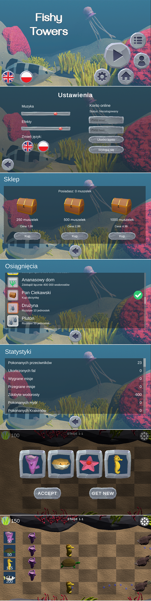

# Fishy Towers
Gra mobilna typu tower defense, zrealizowana jako projekt końcowy przedmiotu "Programowanie gier 2D". Gra została stworzona przez 6-osobowy zespół, poza samą rozgrywką, gra posiada także funkcję synchronizacji w chmurze, oraz system mikrotransakcji.

### Członkowie zespołu: 
- Konrad Basta (Programista)
- Piotr Bednarek (Programista)
- Karol Profic (Programista)
- Piotr Marcinkowski (Grafik)
- Piotr Piertzak (Grafik)
- Wojciech Farej (Projektant rozgrywki)

